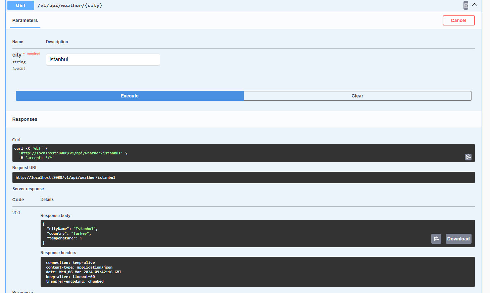

# WeatherAPI


This project is a demonstration of a Spring Boot application for retrieving weather information using an external API (WeatherStack). It allows users to query weather information for different cities.

## Usage

1. Run the application:

- You can run the application directly from your IDE, or
- Use Maven to build and run the application from the command line:
  ```mvn spring-boot:run```

- Once the application is running, you can access the weather information through the provided endpoints.
  
## Endpoints

``` GET /v1/api/weather/{city}:``` Retrieves weather information for the specified city.

Example: ```/v1/api/weather/london```

Endpoint output:


## Dependencies

- Spring Boot
- Spring Data JPA
- Spring Validation
- Spring Web
- H2 Database
- Lombok
-  MapStruct
-  Springdoc OpenAPI
-  Springfox Swagger
